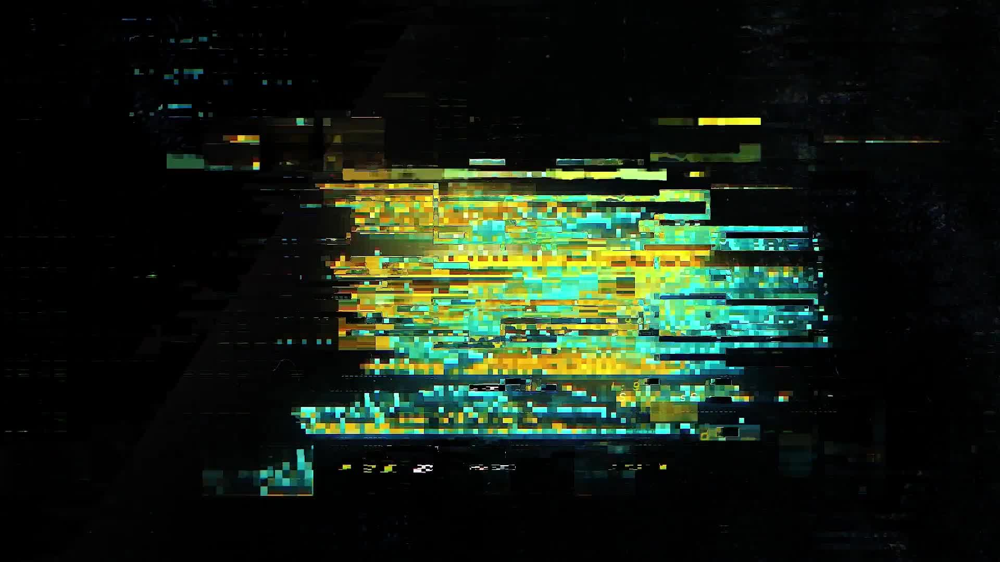
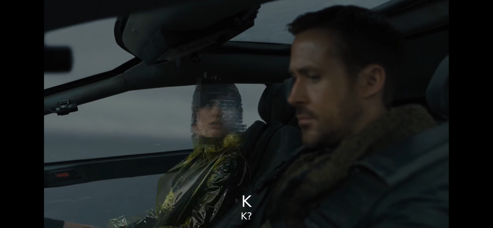
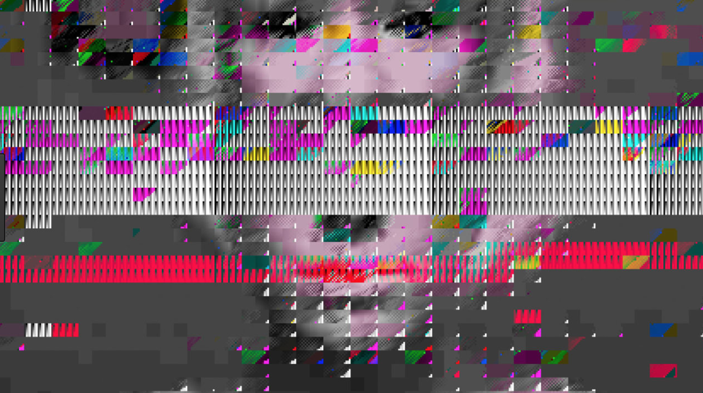

##### bmen0195_9103_tut02
# Quiz 8 – 2025/10/8
## Part 1 – Imaging Technique Inspiration

**Glitch images** are visual elements that appears in both my favorite PC game *Cyberpunk 2077* and the movie *Blade Runner 2049*. In cyberpunk style works, artists and designers often use this kind of visual effect to represent neon lights and electronic elements. It's actually a form of new media art called **glitch art**. It originated from **"errors"** in early hardware (video signals), such as bad connections. It's interesting to mix these **"errors"** into paintings as it breaks traditional visual elements and adds a digital, random feeling that will create strong contrast.

> *CyberPunk 2077* Intro by CD Projekt.

> Ana de Armas as Joi in *Blade Runner 2049*.

> *The Collapse of PAL* by Rosa Menkman.

## Part 2 – Coding Technique Exploration

Through my undergraduate classmate [2x](https://xxuehaoze.info/) (a very talented designer who is now studying design in Switzerland), I learned about his current teacher **Ted Davis**. Ted is a designer who focuses on Creative Coding and open-source contributor to P5.js. On his [archive](https://teddavis.org/#), there is an open-source [library](https://ffd8.github.io/p5.glitch/) for glitching and binary in the web browser. This can partially help me design the glitch effect. (There are also many interesting projects on his website, such as a p5.js library to render graphics on analog vector displays.)

> *Demo screenshot 1.

> [*Demo screenshot 2.](https://editor.p5js.org/ffd8/sketches/5aew0QfB4)

